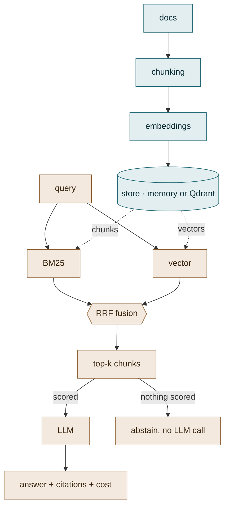

# rag-service

Provider-agnostic RAG service: hybrid retrieval (BM25 + vectors, RRF fusion), pluggable LLM
providers (DeepSeek / GigaChat / any OpenAI-compatible endpoint), citations, retrieval evals,
and per-request cost tracking. Fully testable offline — CI needs zero API keys.

## Why these design choices

- **Hybrid retrieval.** Embeddings blur exact terms (IDs, error codes, port numbers); BM25 misses
  paraphrases. Shared regex tokenization keeps punctuated identifiers such as `5433.` searchable,
  and Reciprocal Rank Fusion combines both rankings without score calibration.
- **Replace-on-ingest.** Re-indexing a document removes all of its previous chunks before writing
  the new version, so shortened documents cannot leave stale searchable content behind.
- **Bounded overlap.** Paragraph-aware chunking preserves the largest configured tail that fits
  beside the next paragraph without exceeding the chunk-size limit.
- **Provider adapters, not a framework.** One `LLM` protocol, three implementations:
  OpenAI-compatible (covers DeepSeek, vLLM, Ollama, OpenAI), GigaChat (OAuth flow, for
  Russian closed-loop deployments), and a deterministic fake for tests. Swapping providers
  is an env var, not a rewrite.
- **Offline-first testing.** `FakeEmbedder` / `FakeLLM` are deterministic, so the entire
  pipeline — chunking, indexing, fusion, prompting, cost math, HTTP layer — is covered by
  fast tests that run anywhere. Real providers are configuration.
- **Cost is a first-class output.** Every `/ask` response reports tokens and estimated USD;
  `/stats` aggregates. You cannot manage LLM spend you don't measure.
- **Answers cite sources.** The prompt forces `[chunk_id]` citations; uncited answers are
  visible immediately in the response payload.
- **Irrelevant questions abstain cheaply.** Zero-score retrieval results are discarded. When no
  context remains, the pipeline returns a constant abstain answer without calling the LLM, so
  reported tokens and provider cost are zero.

## Architecture



<details>
<summary>Same diagram as plain text — Mermaid only renders on github.com</summary>

```
ingest
  docs ──► chunking ──► embeddings ──► store
           paragraph-aware,            in-memory
           overlap, citations          or Qdrant

ask
  query ─┬─► BM25 ───┐
         │           ├─► RRF ─► top-k ─┬─► LLM ─► answer
         └─► vector ─┘                 └─► abstain (no context)
```

</details>

## Quickstart (offline, no keys)

```bash
python -m venv .venv && source .venv/bin/activate
pip install -r requirements-dev.txt        # runtime + Qdrant + lint/type/test
pytest -q                                  # full offline test suite
python eval/run_eval.py --k 3 --min-hit 0.85 --min-mrr 0.7
uvicorn rag_service.api:app --app-dir src  # API on :8000
```

`requirements.txt` is the runtime only; `requirements-qdrant.txt` adds the Qdrant
backend, `requirements-dev.txt` adds the tooling. Every range is upper-bounded, so a
breaking major cannot arrive silently.

```bash
curl -X POST localhost:8000/ingest -H 'Content-Type: application/json' \
  -d '{"doc_id": "runbook", "text": "Staging DB listens on port 5433."}'
curl -X POST localhost:8000/ask -H 'Content-Type: application/json' \
  -d '{"question": "which port does staging listen on?"}'
```

## Real providers

```bash
# DeepSeek (or any OpenAI-compatible endpoint: vLLM, Ollama, OpenAI)
export LLM_PROVIDER=openai-compatible
export LLM_BASE_URL=https://api.deepseek.com/v1
export LLM_API_KEY=sk-...
export LLM_MODEL=deepseek-chat

# GigaChat (Sber, OAuth)
export LLM_PROVIDER=gigachat
export GIGACHAT_AUTH_KEY=...        # base64 client_id:client_secret
export GIGACHAT_SCOPE=GIGACHAT_API_PERS

# Real embeddings
export EMB_PROVIDER=openai-compatible
export EMB_BASE_URL=... EMB_API_KEY=... EMB_MODEL=... EMB_DIM=1536

# Optional Qdrant backend instead of the default in-memory store
export STORE_BACKEND=qdrant QDRANT_URL=http://localhost:6333
docker compose up -d qdrant
```

## Evals

`eval/run_eval.py` measures retrieval quality (hit@k, MRR) against 15 golden questions
over a five-document sample corpus. CI runs the following offline gate:

```bash
python eval/run_eval.py --k 3 --min-hit 0.85 --min-mrr 0.7
```

The command exits with status `1` and reports `"status": "FAIL"` when either threshold
is missed; otherwise it exits with status `0`. This is a deterministic retrieval check,
not a claim about production traffic or provider quality.

## Layout

```
src/rag_service/   config · chunking · embeddings · llm (+cost) · store · retrieval · pipeline · api
eval/              golden.jsonl + run_eval.py (hit@k, MRR)
sample_docs/       five-document corpus used by evals and the quickstart
tests/             offline suite: chunking, fusion, pipeline, cost, API
```

## Quality gates

CI runs two jobs on every push and pull request, both offline and without API keys.

| Job | Checks |
|---|---|
| `quality` | `ruff check` · `mypy` · `pytest --cov` (gate 75%) · retrieval eval (hit@3 ≥ 0.85, MRR ≥ 0.7) |
| `docker` | image builds, container answers `/health`, `/ingest` and `/ask`, and runs as uid `10001` |

Run the same checks locally:

```bash
ruff check . && mypy && pytest -q --cov
docker compose up -d --wait     # app + Qdrant, app waits for Qdrant to be healthy
```

The image is a two-stage build: dependencies are installed into a virtualenv in the
builder, and the runtime stage copies only that virtualenv plus the source. It runs as
a non-root user and declares a `HEALTHCHECK`, which is what `--wait` and the compose
`depends_on: service_healthy` rely on.

Coverage sits at ~78%. The uncovered remainder is the real-provider HTTP adapters
(OpenAI-compatible, GigaChat) and `QdrantStore` — code no offline test exercises.
Raising the gate means adding `httpx.MockTransport` tests, not relaxing the number.

## Roadmap

- Faithfulness eval (LLM-as-judge over golden answers)
- Reranker stage behind the same protocol
- Async ingestion for large corpora
